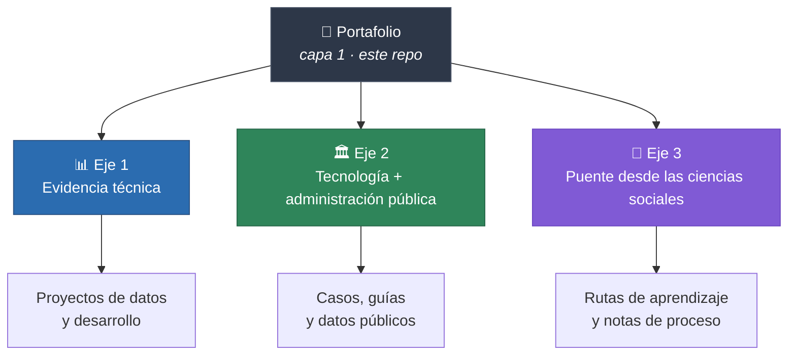

# 🧭 Portafolio · Omar Villaseñor

### De las ciencias sociales al análisis de datos y la tecnología pública

*Un portafolio que también quiere ser un mapa para quien viene del mismo camino.*

 

 

**[Proyectos](#-mapa-de-proyectos)** · **[Rutas de lectura](#-por-dónde-empezar)** · **[Stack](#-stack)** · **[Contacto](#-contacto)**

---

## 👋 Qué es este repositorio

Este repositorio es la **capa 1** de mi portafolio: no contiene código, contiene el **índice y el criterio**. Cada proyecto vive en su propio repositorio, y desde aquí se explica **qué es, por qué existe y qué resuelve**.

Vengo de las **ciencias sociales** y trabajo en **análisis de datos y desarrollo**. Esa doble pertenencia no es un accidente de biografía: es el hilo que ordena todo lo que hay aquí.

> **La idea en una línea:** demostrar lo que sé hacer, y al mismo tiempo dejar el camino señalizado para quien viene detrás.

---

## 🎯 Los tres ejes

Todo lo que publico aquí cae en alguno de estos tres ejes. Si un proyecto no responde a ninguno, probablemente no pertenece a este portafolio.

### 📊 Eje 1 · Evidencia técnica

Para quien evalúa perfiles: proyectos con problema definido, datos reales, decisiones justificadas y resultado verificable. Cada repositorio incluye contexto, método, limitaciones y cómo reproducirlo.

**Lo que busco mostrar:** que sé formular la pregunta antes de escribir la consulta.

### 🏛️ Eje 2 · Tecnología + administración pública

Un espacio para documentar **cómo se integra la tecnología a lo público sin romperlo**: qué funciona, qué fracasa y por qué. Análisis con datos abiertos, prototipos de herramientas para gobierno, notas sobre transparencia, compras públicas, indicadores y evaluación.

**Lo que busco mostrar:** que la tecnología en el sector público es un problema institucional antes que técnico.

### 🌱 Eje 3 · Puente para quien viene de las ciencias sociales

La parte que más me importa. Si estudiaste sociología, ciencia política, antropología, economía, historia, trabajo social o comunicación y estás intentando entrar, mejorar o simplemente entender el análisis de datos y el desarrollo: **aquí encuentras el camino que yo recorrí, con los tropiezos incluidos.**

**Lo que busco mostrar:** que tu formación no es un déficit que compensar, sino una ventaja que casi nadie sabe usar.

---

## 🗺️ Mapa de proyectos

> 🚧 En construcción. Este índice crece conforme publico cada repositorio.

### Análisis de datos

| Proyecto | Qué resuelve | Stack | Repo |
|---|---|---|---|
| _Próximamente_ | — | — | — |

### Tecnología y administración pública

| Proyecto | Qué resuelve | Stack | Repo |
|---|---|---|---|
| _Próximamente_ | — | — | — |

### Recursos de aprendizaje

| Recurso | Para quién | Repo |
|---|---|---|
| _Próximamente_ | — | — |

<b>📌 Cómo leer cada ficha</b>

 

Cada proyecto del portafolio sigue la misma estructura, para que se pueda comparar y evaluar rápido:

- **Problema** — la pregunta real, no el dataset.
- **Datos** — origen, cobertura, limitaciones conocidas.
- **Método** — qué se hizo y por qué esa técnica y no otra.
- **Resultado** — hallazgo, producto o decisión que habilita.
- **Reproducibilidad** — cómo correrlo desde cero.
- **Qué haría distinto** — la sección que casi nadie escribe y que más dice de un perfil.

---

## 🧭 Por dónde empezar

Distintas personas llegan aquí buscando cosas distintas. Elige tu ruta:

<table>
<tr>
<td width="33%" valign="top">

### 💼 Vienes a evaluarme

Ve directo al **[Eje 1](#-eje-1--evidencia-técnica)**. Cada ficha declara problema, método y resultado en menos de un minuto de lectura.

</td>
<td width="33%" valign="top">

### 🌱 Vienes de las ciencias sociales

Empieza por el **[Eje 3](#-eje-3--puente-para-quien-viene-de-las-ciencias-sociales)**. No necesitas saber programar para leerlo.

</td>
<td width="33%" valign="top">

### 🏛️ Trabajas en lo público

Ve al **[Eje 2](#-eje-2--tecnología--administración-pública)**. Casos, datos abiertos y herramientas aplicables.

</td>
</tr>
</table>

---

## 🛠️ Stack

| Área | Herramientas |
|---|---|
| **Análisis y datos** | Python (pandas, numpy), SQL, R |
| **Visualización** | matplotlib, seaborn, Power BI |
| **Métodos** | Estadística aplicada, análisis exploratorio, métodos mixtos |
| **Entorno** | Git, Jupyter, línea de comandos |

> ✏️ *Ajusta esta tabla a tu stack real; está puesta como punto de partida.*

---

## 🧱 Cómo está organizado

- **Este repositorio (capa 1)** — índice, criterio editorial y punto de entrada.
- **Un repositorio por proyecto (capa 2)** — código, datos y documentación propia.
- **Convención de nombres** — `datos-<tema>`, `gov-<tema>`, `guia-<tema>`, para que el eje se lea desde el nombre.

Los proyectos se agregan al mapa cuando están **terminados y documentados**, no cuando están empezados. Un portafolio corto y sólido pesa más que uno largo y a medias.

---

## 💬 Una nota personal

Aprender a programar y analizar datos viniendo de las ciencias sociales tiene una dificultad que casi nunca se nombra: **no es técnica, es de pertenencia.** Los tutoriales asumen un punto de partida que no es el tuyo, y es fácil confundir "no entiendo esta sintaxis" con "esto no es para mí".

Sí es para ti. Y las preguntas que aprendiste a hacer —sobre poder, contexto, sesgo, quién queda fuera de los datos— son exactamente las que le faltan a buena parte de este campo.

Si algo de lo que hay aquí te sirve, ya cumplió su función.

---

## 📬 Contacto

 

**¿Vienes de las ciencias sociales y estás empezando?**
Escríbeme. Respondo.

Última actualización: agosto 2026

